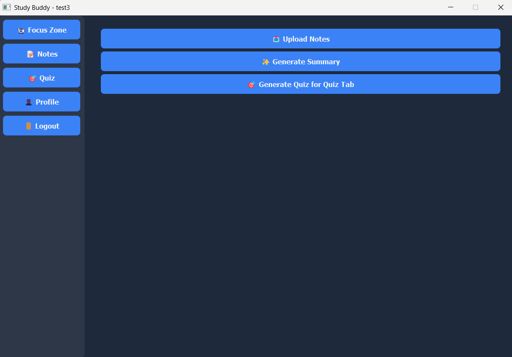
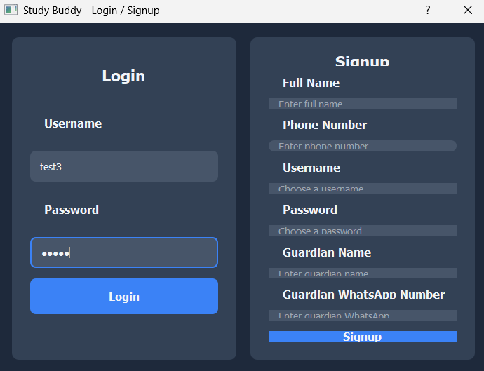
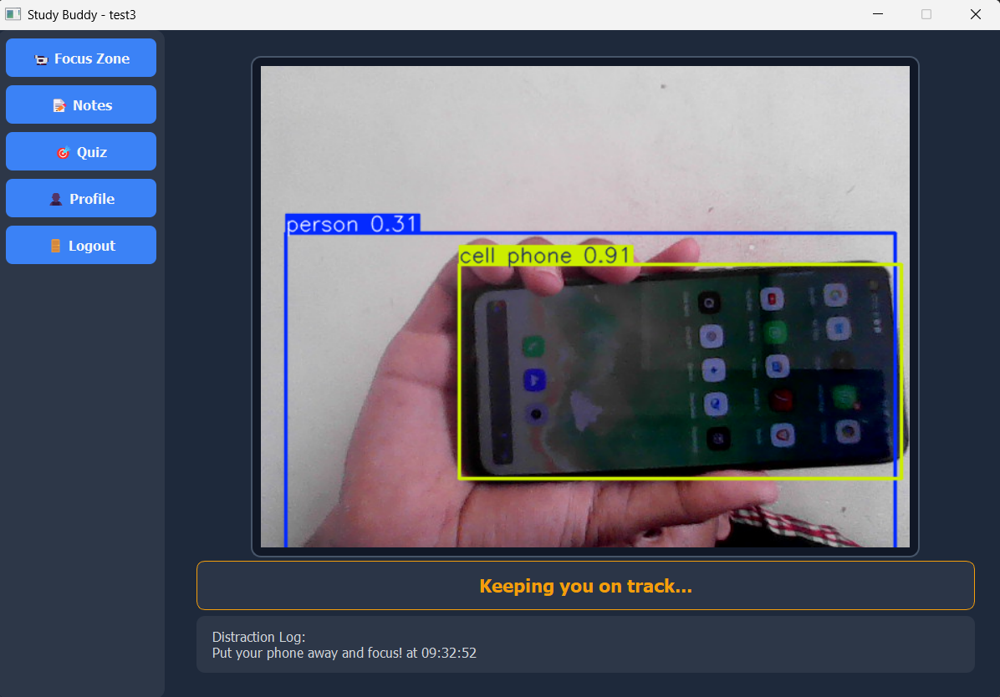
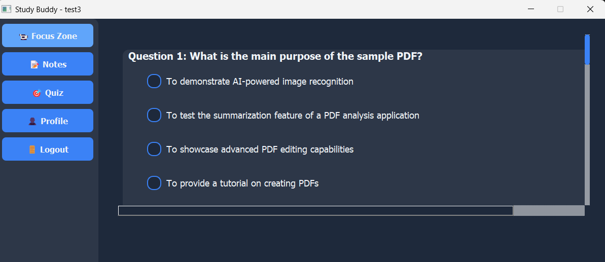
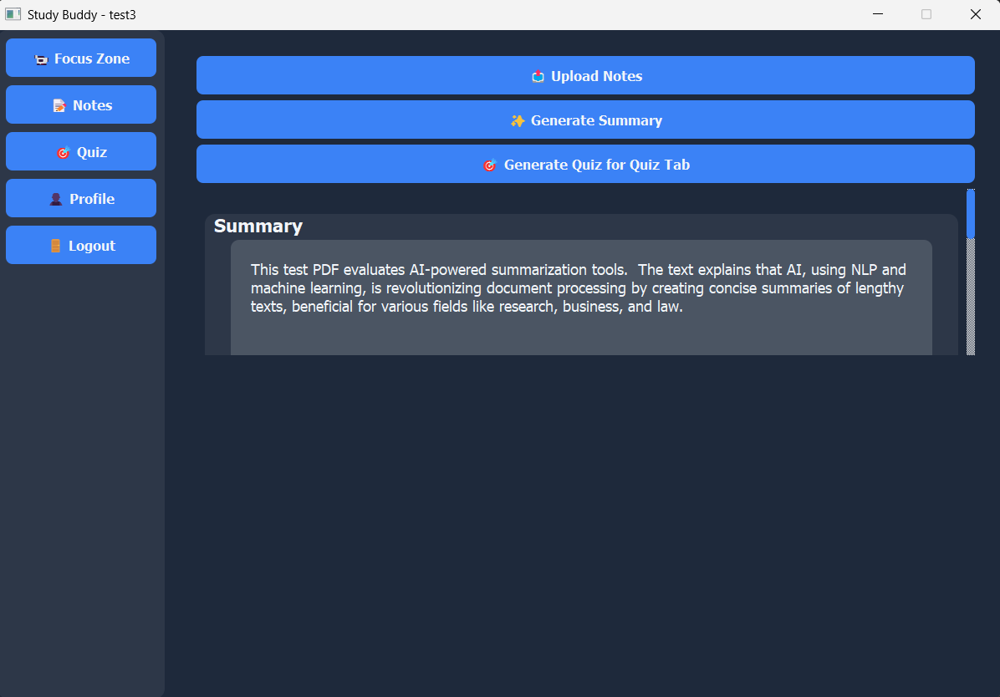

# EduVisionAI – Study Enhancer

## Description
AI-powered tool for focus detection and automated summarization to help students study smarter. Detects distractions, summarizes content, and provides actionable insights.

## Tech Stack
- Python, OpenCV, YOLOv8, NLP
- Focus & distraction detection
- Automated summarization

## Screenshots

<!-- Two per row for wider screens, fallback to vertical on narrow -->
<p>
  
  
</p>

<p>
  
  
</p>

<p>
  
</p>


## Setup
```bash
git clone https://github.com/Shantanu-00/eduvision.git
cd eduvision
python -m venv .venv
source .venv/bin/activate  # or .venv\Scripts\activate on Windows
pip install -r requirements.txt

## Usage
python main.py

